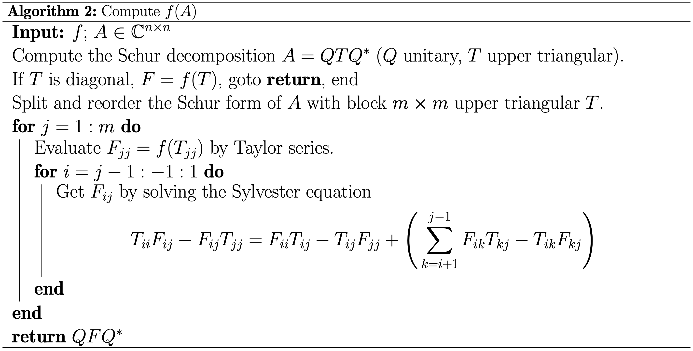
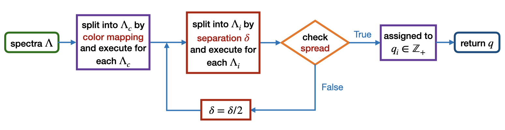

# Summary

The computation of matrix-variable functions (i.e., $f:\mathbb{C}^{n\times n}\to\mathbb{C}^{n\times n}$, $A\mapsto f(A)$) and their Fréchet derivatives plays a crucial role in electronic structure calculations, especially within density functional perturbation theory and response theory. 
Although it is trivial to compute $f(A)$ for Hermitian $A$, the Fréchete derivatives requires an accurate evaluation of the higher-order divided differences, which by Opitz's formula[@deBoor2005] is equivalent to the exact computation of $f(A)$ for non-normal $A$. 

In this work, we develop [MatrixFuns.jl](https://github.com/xuequan818/MatrixFuns.jl) a Julia package[@julia] to provide the robust computation of matrix functions for arbitrary square matrices and higher-order Fréchet derivatives for Hermitian matrices. 
The computation of matrix functions is based on the Schur-Parlett algorithm[@DaviesHigham03,HighamMohy10], but with some improvements so that it can also support discontinuous functions.  

# Statement of need
`MatrixFuns.jl` aims to provide convincing computations for general matrix functions and arbitrary-order Fréchet derivatives (including divided differences) in Julia.
Although Julia provides some native matrix functions, the choice is limited. 
Moreover, while some Julia packages offer tools for calculating Fréchet derivatives and divided differences, these are typically restricted to first-order computations. 
In MATLAB, the [funm](https://www.mathworks.com/help/symbolic/sym.funm.html) function supports the evaluation of general matrix functions but does not handle discontinuous functions. Additionally, MATLAB also lacks functions to compute higher-order Fréchet derivatives.

# Mathematics
`MatrixFuns.jl` implements the following algorithm to compute the matrix-variable functions:

In particular, to handle discontinuous or singular functions, we employ an adaptive splitting strategy:

Here, the color mapping $\mathfrak{c}:\mathbb{C}\to\mathbb{Z}$ assigns an integer to each eigenvalue, and eigenvalues with the same integer will be split together. The separation parameter $\delta$ enusures that eigenvalue partitions satisfy the following conditions:
* Separation between blocks: $\min\big\{|\lambda_i -\lambda_j| : \lambda_i\in \Lambda_i,\, \lambda_j\in \Lambda_j,\, i\neq j\big\}>\delta$.
* Separation within blocks: for $\#\Lambda_i> 1$, $\forall \lambda\in \Lambda_i$, $\exists \mu\in \Lambda_i$ and $\mu \neq \lambda$, s.t. $|\lambda - \mu| \leq \delta$.
  
Let $\Delta:=\max\big\{|\lambda -\mu| : \lambda,\,\mu\in \Lambda_i\big\}$ be the spread of $\Lambda_i$, $M$ be the maximum Taylor series order, $\alpha$ be the scaling of the Talyor series error, and $\varepsilon$ be the tolerance. We stop the split until 
```math
\bigg(\frac{\Delta}{\alpha}\bigg)^{M+1} \leq \frac{\varepsilon}{\delta},
```
where the left-hand side is the Taylor expansion error and the right-hand side is the splitting error. Note that in the limit $M=\infty$, this condition reduces to $\Delta < \alpha$.

Let $\mathcal{H}:=\mathbb{C}^{n\times n}_{\rm herm}$ denote the vector space of $n\times n$ Hermitian matrices. Given $H\in\mathcal{H}$ and pertubations $h_1,...h_N\in\mathcal{H}$. If $f$ is an $N$ times continuously differentiable function on a subset of $\mathbb{C}$ containing the spectrum of $H+t_1h_1+\cdots + t_Nh_N$, the $N$-th order Fréchet derivative of $f(H)$ admits a formulation analogous to the Daleckii-Krein theorem, 
```math
\begin{equation*}
   	{{\rm d}}^{N}f(H)h_1\cdots h_N =\sum_{i_0,\cdots,i_{N}=1}^n\phi_{i_0}\Bigg(\sum_{p\in\mathcal{P}_N}(h_{p(1)})_{i_0,i_1}\cdots (h_{p(N)})_{i_{N-1},i_{N}}\Bigg){f[\lambda_{i_0},\cdots,\lambda_{i_{N}}]}\phi_{i_{N}}^{-1}.
   \end{equation*}
```
Here, $p\in\mathcal{P}_N$ is an arbitrary permutation of $\{1,\cdots,N\}$, and $H$ has the eigen decomposition $H=\sum_i^n\lambda_i\phi_i\phi_i^{-1}$. The matrix elements are given by $(h_{p(k)})_{i,j}:=\phi_i^{-1}h_{p(k)}\phi_j$. The higher-order divided differences $f[x_0, \dots, x_N]$ defined recursively by
```math
    	f[x_0, \dots, x_N]
    	= \begin{cases} 
    		(f[x_0,\dots,x_{N-1}]-f[x_1,\dots,x_{N}])/(x_0-x_N), &{\rm if}\,\,x_0\neq x_N,\\ 
    		\frac{\partial}{\partial z}f[z,x_1, \dots,x_{N-1}]{\big|}_{z=x_0}, & {\rm if}\,\,x_0= x_N.
    	\end{cases}
```
Note that this recursive formula is prone to catastrophic cancellation when certain values $x_i$ are close. To improve numerical stability, we introduce the divided-difference table:
```math
T_f(x_0,\dots,x_{N}) = 
    	\begin{bmatrix}
    		f[x_0] & f[x_0,x_1]& \cdots& f[x_0,\dots,x_N]\\
    		&f[x_1]&\ddots&\vdots\\
    		&&\ddots &f[x_{N-1},x_N]\\
    		&&&f[x_N]
    	\end{bmatrix}.
```
Using the Opitz’s formula, the higher-order divided-differences can be accurately computed by 
```math
T_f(x_0,\dots,x_{N}) = f(J)\qquad
    	{\rm with}\qquad
    	J = 
    	\begin{bmatrix}
    		x_0&1&&\\
    		&x_1&\ddots&\\
    		& &\ddots&1\\
    		&&&x_N
    	\end{bmatrix}.
```
Therefore, the key point in evaluating the Fréchet derivative reduces to computing matrix functions for upper triangular matrices.

# Examples
We first show how to use MatrixFuns.jl to compute the matrix functions, divided differences, and Fréchet derivatives for smooth functions such as `exp`.
```julia
using MatrixFuns

A = [-0.1 1.0 0.0; 0.0 -0.05 1.0; 0.0 0.0 0.01];

mat_fun(exp, A) # returns the matrix function exp(A)
3×3 Matrix{Float64}:
 0.904837  0.92784   0.477323
 0.0       0.951229  0.980346
 0.0       0.0       1.01005

div_diff(exp, -0.1, -0.05, 0.01) # returns the second-order divided difference exp[-0.1,-0.05,0.01]
0.47732345844677654

H = 0.5 * (A + A'); # generates a Hermitian matrix

hs = map(i -> i * H, [1, 2]);

mat_fun_frechet(exp, H, hs) # returns the second-order Fréchet derivative d^2exp(H)hs[1]hs[2]
3×3 Matrix{Float64}:
 0.519468  0.347941  0.55445
 0.347941  1.10871   0.46992
 0.55445   0.46992   0.610653
 ```


In addition to the usual smooth functions, MatrixFuns.jl can also support special functions and discontinuous functions. Here, we use the error function `erf` and the sign function `sign` to show how it can be used to handle functions with different smoothness.
```julia
using MatrixFuns, SpecialFunctions

A = [-0.1 1.0 0.0; 0.0 -0.05 1.0; 0.0 0.0 0.01];

mat_fun(erf, A) # smooth function
3×3 Matrix{Float64}:
 -0.112463   1.12182   0.0524648
  0.0       -0.056372  1.12759
  0.0        0.0       0.0112834

mat_fun(x -> erf(500x), A; scale=0.1, color=x->x<0 ? 1 : 2) # singular function
3×3 Matrix{Float64}:
 -1.0   0.0  303.03
  0.0  -1.0   33.3333
  0.0   0.0    1.0

mat_fun(sign, A; sep=Inf, color=x->Int(sign(x))) # discontinuous function with smooth branches
3×3 Matrix{Float64}:
 -1.0   0.0  303.03
  0.0  -1.0   33.3333
  0.0   0.0    1.0
```

# Reference
